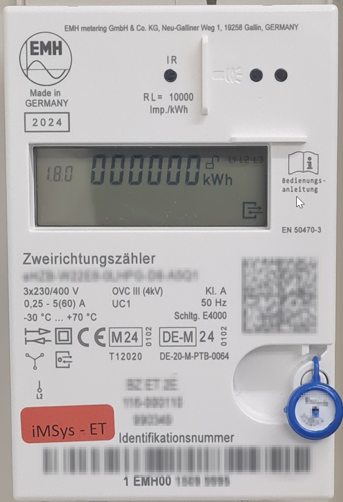

# OBIS of EMH Meter

Meter produced in 2024

| Binary               | OBIS             | Description                 | Unit with PIN |Availabe without PIN| 
|----------------------|------------------|-----------------------------|--------|---------------------------|
| 07 01 00 60 32 01 01 | 1-0:96.50.1*1    | Manufacturer (ASCII "EMH")  |        |X                          |
| 07 01 00 60 01 00 FF | 1-0:96.1.0*255   | Meter number (Last 3 bytes) |        |X                          |
| 07 01 00 00 02 00 00 | 1-0:0.2.0*0      | Firmware Version 1          |        |X                          |
| 07 01 00 60 5A 02 01 | 1-0:96.90.2*1    | ?                           |        |X                          |
| 07 01 00 00 02 00 01 | 1-0:0.2.0*1      | Firmware Version 2          |        |X                          |
| 07 01 00 60 5A 02 02 | 1-0:96.90.2*2    | CRC of used parameters      |        |X                          |
| 07 01 00 01 08 00 FF | 1-0:1.8.0*255    | Energy consumed             | 0.1 Wh |X - Low resolution (kWh)   |
| 07 01 00 02 08 00 FF | 1-0:2.8.0*255    | Energy produced             | 0.1 Wh |X - Low resolution (kWh)   |
| 07 01 00 20 07 00 FF | 1-0:32.7.0*255   | Voltage L1                  | 0.1 V  |                           |
| 07 01 00 34 07 00 FF | 1-0:52.7.0*255   | Voltage L2                  | 0.1 V  |                           |
| 07 01 00 48 07 00 FF | 1-0:72.7.0*255   | Voltage L3                  | 0.1 V  |                           |
| 07 01 00 1F 07 00 FF | 1-0:31.7.0*255   | Current L1                  | 0.01 A |                           |
| 07 01 00 33 07 00 FF | 1-0:51.7.0*255   | Current L2                  | 0.01 A |                           |
| 07 01 00 47 07 00 FF | 1-0:71.7.0*255   | Current L3                  | 0.01 A |                           |
| 07 01 00 24 07 00 FF | 1-0:36.7.0*255   | Power Real L1               | W      |                           |
| 07 01 00 38 07 00 FF | 1-0:56.7.0*255   | Power Real L2               | W      |                           |
| 07 01 00 4C 07 00 FF | 1-0:76.7.0*255   | Power Real L3               | W      |                           |
| 07 01 00 10 07 00 FF | 1-0:16.7.0*255   | Power Real                  | W      |                           |
| 07 01 00 51 07 01 FF | 1-0:81.7.1*255   | Angle U-L2 to U-L1          | &deg;  |                           |
| 07 01 00 51 07 02 FF | 1-0:81.7.2*255   | Angle U-L3 to U-L1          | &deg;  |                           |
| 07 01 00 51 07 04 FF | 1-0:81.7.4*255   | Angle I-L1 to U-L1          | &deg;  |                           |
| 07 01 00 51 07 0F FF | 1-0:81.7.15*255  | Angle I-L2 to U-L2          | &deg;  |                           |
| 07 01 00 51 07 1A FF | 1-0:81.7.26 *255 | Angle I-L3 to U-L3          | &deg;  |                           |
| 07 01 00 0E 07 00 FF | 1-0:14.7.0*255   | Frequency                   | 0,1 Hz |                           |

Useful links:  
* https://www.avacon-netz.de/content/dam/revu-global/avacon-netz/documents/Energie_anschliessen/Stromnetz/TAB/Techn_Mindestanforderung_MSB_mME_Strom.pdf  
* https://www.rng.de/bedienungsanleitung-logarex-lk13be904619.pdfx  
* https://www.bsi.bund.de/SharedDocs/Downloads/DE/BSI/Publikationen/TechnischeRichtlinien/TR03109/TR-03109-1_Anlage_Feinspezifikation_Drahtgebundene_LMN-Schnittstelle_Teilb.pdf?__blob=publicationFile  
* http://www.stefan-weigert.de/php_loader/sml.php  

Serial number in raw_data.bin and raw_data.txt have been obfuscated (Set to 0x00). So the CRCs will not match!  

CRC16 (CRC-16/IBM-SDLC)
* Poly:   0x1021
* Init:   0xFFFF
* RefIn:  TRUE
* RefOut: TRUE
* XorOut: 0xFFFF

  

